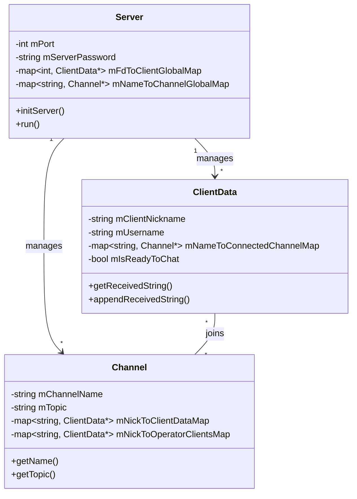

# IRCPP

A robust IRC (Internet Relay Chat) server implementation written in C++98. This project adheres to the RFC standards to provide a fully functional chat server environment.

## Features

- **Client Authentication**: Secure login process requiring password, nickname, and username.
- **Channel Management**: Create and join channels with automated message broadcasting to all members.
- **Private Messaging**: Support for 1:1 private messages (PRIVMSG) between clients.
- **Operator Privileges**: Distinguished roles between regular users and channel operators.
- **Operator Commands**:
  - `KICK`: Eject a user from a specific channel.
  - `INVITE`: Invite users to a channel.
  - `TOPIC`: Change or view the channel's topic.
  - `MODE`: Manage channel modes and permissions.
- **Channel Modes**:
  - `i`: Set/remove Invite-only channel.
  - `t`: Restrict TOPIC command to operators.
  - `k`: Set/remove channel key (password).
  - `o`: Give/take channel operator privilege.
  - `l`: Set/remove user limit for the channel.

## Technical Specifications

- **Language**: C++98
- **I/O Multiplexing**: Utilizes `kqueue` for efficient event-driven network communication.
- **Platform Support**: Optimized for macOS/BSD. Linux support available via `libkqueue-dev`.
- **Compliance**: Implements standard IRC protocol behaviors.

## Architecture



## Getting Started

### Compilation

Build the project using the provided `Makefile`:

```bash
make
```

This will generate the `ircserv` executable.

### Execution

Launch the server by specifying a port and a password:

```bash
./ircserv <port> <password>
```

- `<port>`: The port number the server will listen on.
- `<password>`: The connection password required for client authentication.

## Testing

You can connect to the server using standard IRC clients like `irssi` or simple networking tools like `nc` (netcat):

```bash
nc localhost <port>
```

The repository also includes helper scripts for testing:
- `./test.sh`
- `./nc.sh`